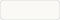

# Thurin Brand Kit

Brand assets for Thurin - privacy-preserving identity verification.

## Logo

The Thurin logo is a stylized fingerprint representing identity verification with privacy.

### Icon

  

| File | Use |
|------|-----|
| `logo-icon.svg` | Primary icon |
| `logo-icon-dark-bg.svg` | For dark backgrounds |
| `logo-icon-padded.svg` | With padding for social/favicons |
| `logo-icon-verified.svg` | With checkmark |

### Full Logo

| File | Size | Background |
|------|------|------------|
| `logo-2048.png` | 2048px | Light |
| `logo-2048-dark.png` | 2048px | Dark |
| `logo-400.png` | 400px | Light |
| `logo-dark-400.png` | 400px | Dark |

### Social / Headers

| File | Dimensions | Use |
|------|------------|-----|
| `header-1500x500.png` | 1500×500 | Twitter/X header |
| `og-image.svg` | 1200×630 | Open Graph |

## Colors

| Swatch | Name | Hex | Use |
|--------|------|-----|-----|
|  | **Sage Green** | `#7c9a3e` | Primary - outer arcs |
|  | **Gold** | `#c9a227` | Accent - inner arcs |
|  | **Dark** | `#1a1a12` | Dark backgrounds |
|  | **Light** | `#faf9f5` | Light backgrounds |
|  | **Muted** | `#a8a598` | Secondary text |

## Typography

- **Primary**: System font stack (`-apple-system, BlinkMacSystemFont, sans-serif`)
- **Wordmark**: Bold (700 weight)

## Usage Guidelines

### Do
- Use the logo with adequate padding
- Use on solid backgrounds (dark or light)
- Link to thurin.id when displaying the logo

### Don't
- Modify the logo colors
- Add effects (shadows, gradients, etc.)
- Use on busy backgrounds
- Stretch or distort

## License

Logo and brand assets © Thurin. All rights reserved.
